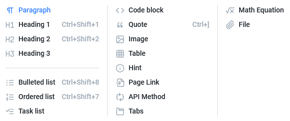
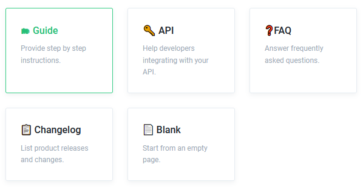
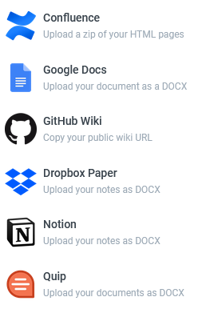

# 📃 Pages

A **page** is a place where all your content goes on.

You can create unlimited pages in a Space. Once a page is created, you can just start typing! 


**Important:**   
The first page you create in a space cannot be reordered or nested in the left panel.


You can format a page with in-built formatting options.


You can also type a page using Markdown language.


## Renaming a Page

You can change a page name by just changing the title of the page or by clicking **More** option in the right panel.


You can set or change a page slug under **More** menu.


## Grouping of Pages

Pages can be grouped or indexed under different names. 


A page can be nested under other pages.


## Default Templates

While start typing a new page, you can either start by choosing a available template or just type to continue with an empty page.

## Importing a Page

You can create a new page by importing files such as Markdown, ZIP, HTML, DOCX or content from


GitBook does not connect to above services.   
It only allows you upload files from your local storage.   
You should keep your required file in your computer before importing.


## Exporting a Page

A page can be exported as only PDF.

## Save and Merge options

GitBook does not autosave your works. Each time you edit or make changes to your Space or Page, you must manually **Save** your work.

### What does a Save do?

Doing a **Save** only records your work as drafts. A draft can contain one or more edits you have made.

A **draft** is an editable version of your content only accessible by your members, and is automatically created once you start writing \(first letter on the editor, creation of a new page, uploading a picture, etc.\).


**Saving** a work does not reflect on your shared links.


### What does a Merge do?

Doing a **Merge** will combine all your drafts and saves your work completely.


All merges are stored and you can restore any merge and rollback to it.



**Merging** a work completely saves your work and updates all your shared links.


